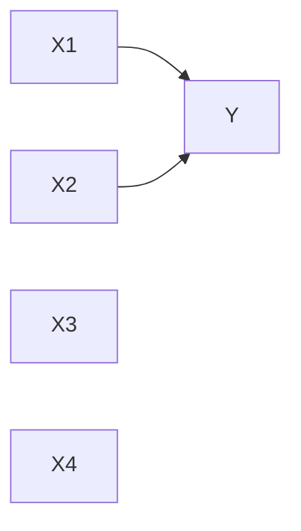
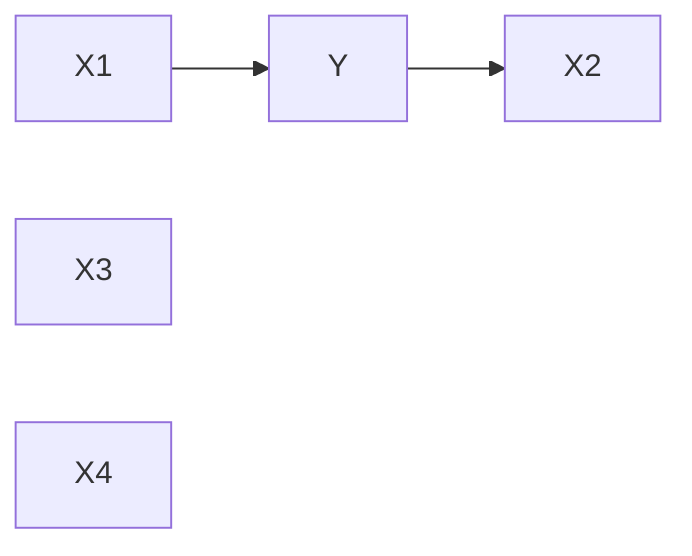

## Question 4.1 — Markov Blanket

### (a) Markov Blanket and Multicollinearity

#### Markov Blanket of Y

Given:
- X1 and X2 are significant predictors of Y  
- X3 and X4 are not significant  

The Markov Blanket of Y is:

$$
\{X1, X2\}
$$

---

#### Graph (Part a)

**Interpretation:**
- X1 and X2 directly influence Y → part of Markov blanket  
- X3 and X4 are disconnected → irrelevant  

---

#### Relation to Multicollinearity

- Multicollinearity = correlation among predictors  
- Markov blanket = relevant predictors of Y  

---

### (b) Temporal / Causal Markov Blanket

Given:
- X1 occurs before Y → cause  
- X2 occurs after Y → effect  

The Markov Blanket of Y is:

$$
\{X1, X2\}
$$

---

#### Graph (Part b)

---

#### Causal Interpretation

- X1 = parent (cause of Y)  
- X2 = child (effect of Y)  

---

### Final Summary

- (a) Markov Blanket: {X1, X2}  
- (b) Markov Blanket: {X1, X2} with causal direction X1 → Y → X2  
