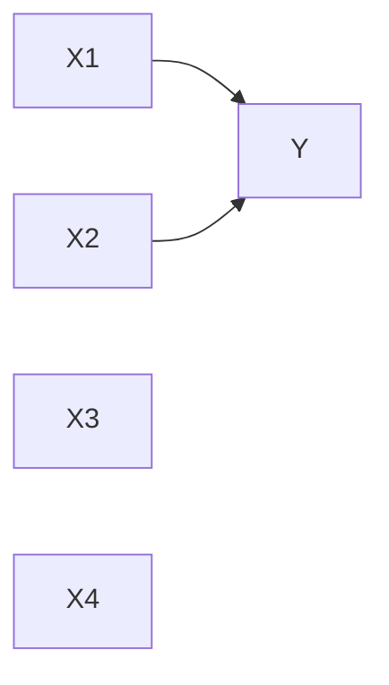
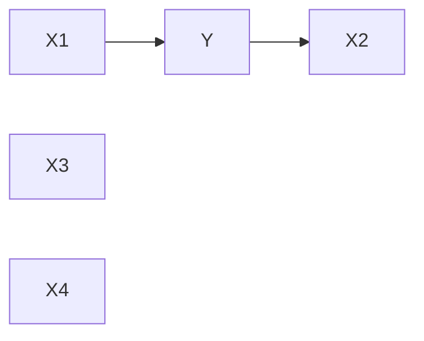

## Question 3 — Markov Blanket

### (a) Markov Blanket and Multicollinearity

#### Markov Blanket of Y

Given:
- X1 and X2 are significant predictors of Y  
- X3 and X4 are not significant  

The Markov Blanket of Y is:

$$
\{X1, X2\}
$$

#### Graph (Part a)

Interpretation:
- X1 and X2 directly influence Y and are part of the Markov blanket  
- X3 and X4 are not connected and are irrelevant  

#### Relation to Multicollinearity

- Multicollinearity refers to correlation among predictors  
- Markov blanket shows which variables are relevant for predicting Y  

### (b) Temporal / Causal Markov Blanket

Given:
- X1 occurs before Y and is a potential cause  
- X2 occurs after Y and is an effect  

The Markov Blanket of Y is:

$$
\{X1, X2\}
$$

#### Graph (Part b)

#### Causal Interpretation

- X1 is a parent and a potential cause of Y  
- X2 is a child and an effect of Y  

### (c) Difference / ACE (Average Causal Effect)

We quantify the causal impact of X1 on Y.

#### Definition

$$
ACE = P(Y = 1 \mid do(X1 = 1)) - P(Y = 1 \mid do(X1 = 0))
$$

#### Simple Example

Assume:

- \( P(Y = 1 \mid X1 = 1) = 0.70 \)  
- \( P(Y = 1 \mid X1 = 0) = 0.40 \)  

Then:

$$
ACE = 0.70 - 0.40 = 0.30
$$

#### Interpretation

- Increasing X1 from 0 to 1 increases the probability of Y by 30 percentage points  
- This represents the causal effect of X1 on Y  

#### Connection to Markov Blanket

- X1 is in the Markov Blanket of Y  
- Markov Blanket shows which variables matter for prediction  
- ACE measures how much a variable affects Y causally  

### Key Takeaway

Markov Blanket identifies the variables needed to predict Y, while ACE quantifies the causal impact of those variables.
