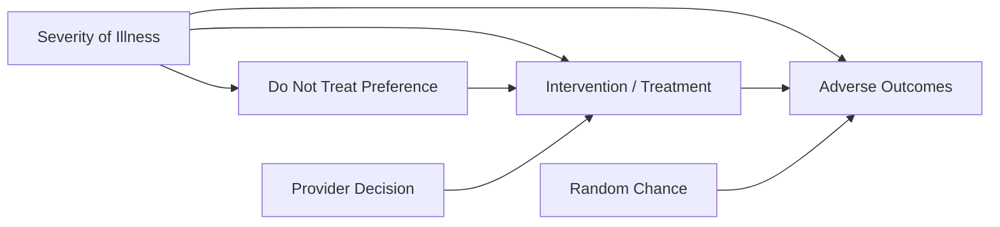

# Causal Analysis: Treatment and Adverse Outcomes

## Research Question
What is the causal effect of **medical intervention/treatment (T)** on **adverse outcomes (A)**?

---

## Directed Acyclic Graph (DAG)

---

## Variables

| Symbol | Variable |
|------|-----------|
| S | Severity of illness |
| D | Do not treat preference |
| P | Provider decision |
| T | Intervention / Treatment |
| A | Adverse outcomes |
| R | Random chance |

---

## Key Relationships

- **S → D**
- **S → T**
- **S → A**
- **D → T**
- **P → T**
- **T → A**
- **R → A**

**Severity of illness (S)** is a **confounder** because it affects both **treatment** and **adverse outcomes**.

---

## Structural Equations

**Do Not Treat Preference**

D = a + c × S*

**Treatment**

T = a + c × S* + d × D* + e × P*

**Adverse Outcomes**

A = a + b × T* + c × S* + d × D + e × P + f × R

---

## No Treatment Scenario

If **T = 0**:

A = a + c × S* + f × R

Adverse outcomes depend on:

- Severity of illness  
- Random chance  

---

## Backdoor Adjustment

Backdoor path:

T ← S → A

Adjusting for **Severity of illness (S)** blocks this path.

**Valid adjustment set**

{ S }

---

## Identification

The causal effect of treatment on adverse outcomes is expressed as:

P(A | do(T))

Using the backdoor criterion:

P(A | do(T)) = Σₛ P(A | T, S) P(S)

---

## Key Takeaway

To estimate the causal effect of **treatment on adverse outcomes**, we must **adjust for severity of illness**, which blocks the confounding backdoor path.
